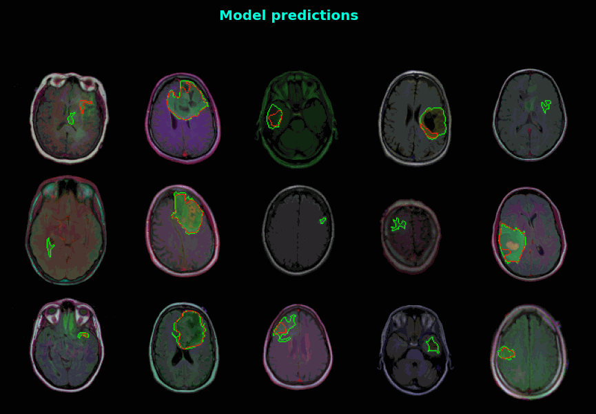

# Brain MRI segmentation with Resnext50 as backbone - A Pytorch implementation

   



## Introduction
Image segmentation has various applications in industry, particularly in the medical industry the possiblities for automated diagnoses and cheaper medical imaging programs motivate researchers to invest in producing robust image segmentation models.

In this project, we implement and train a custom Unet with ResNeXt50 as backbone.

## Dataset
The dataset used in this project is the [Brain MRI Segmentation Dataset](https://www.kaggle.com/mateuszbuda/lgg-mri-segmentation) from Kaggle. The dataset contains 110 images of brain MRI scans with their corresponding segmentation masks. The images are of size 512x512 and the masks are of size 256x256.

The dataset is then split into:
(3005, 3) (393, 3) (531, 3) for training, validation and testing respectively.

## Model
The model used in this project is a custom Unet with ResNeXt50 as backbone. 
```python
class ResNeXtUNet(nn.Module):

    def __init__(self, n_classes=1):
        super().__init__()
        
        self.base_model = resnext50_32x4d(pretrained=True)
        self.base_layers = list(self.base_model.children())
        filters = [4*64, 4*128, 4*256, 4*512]
        
        # Down
        self.encoder0 = nn.Sequential(*self.base_layers[:3])
        self.encoder1 = nn.Sequential(*self.base_layers[4])
        self.encoder2 = nn.Sequential(*self.base_layers[5])
        self.encoder3 = nn.Sequential(*self.base_layers[6])
        self.encoder4 = nn.Sequential(*self.base_layers[7])

        # Up
        self.decoder4 = DecoderBlock(filters[3], filters[2])
        self.decoder3 = DecoderBlock(filters[2], filters[1])
        self.decoder2 = DecoderBlock(filters[1], filters[0])
        self.decoder1 = DecoderBlock(filters[0], filters[0])

        # Final Classifier
        self.last_conv0 = ConvRelu(256, 128, 3, 1)
        self.last_conv1 = nn.Conv2d(128, n_classes, 3, padding=1)
                       
        
    def forward(self, x):
        # Down
        x = self.encoder0(x)
        e1 = self.encoder1(x)
        e2 = self.encoder2(e1)
        e3 = self.encoder3(e2)
        e4 = self.encoder4(e3)

        # Up + sc
        d4 = self.decoder4(e4) + e3
        d3 = self.decoder3(d4) + e2
        d2 = self.decoder2(d3) + e1
        d1 = self.decoder1(d2)

        # final classifier
        out = self.last_conv0(d1)
        out = self.last_conv1(out)
        out = torch.sigmoid(out)
        
        return out
```
The model is trained for 50 epochs with a batch size of 16. The model is trained on a Nvidia RTX 3060 GPU.

## Loss
The loss function used in this project is the combination of BCE (Binary Cross Entropy) and Dice loss.


## Results
The model managed to achieve a Mean DICE on validation: 0.938 and a Mean IoU of the test images of - 92.28%.

The following is an example of the model's predictions on the test set.


## TODO
- [ ] Make hyperparameters configurable
- [ ] Dockerize
- [ ] Web app + API
- [ ] Test more models?

